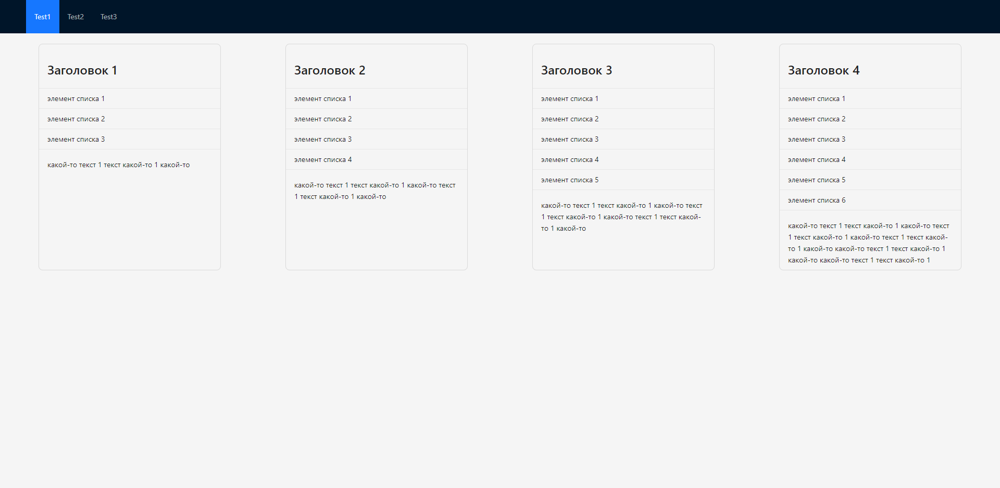

# Webpack 5 Module Federation GPB Test with React/Typescript [in dev]

This project consist of five pieces, a host app `gpb_container`, `gpb_ui` and three remotes `gpb_test1` `gpb_test2` `gpb_test3`.

Workflow:

- [`gpb_test1`](https://github.com/RostislavBerezhnoy/GPB-with-microfrontends/tree/develop/packages/gpb_test1) expose Test1 app.
- [`gpb_test2`](https://github.com/RostislavBerezhnoy/GPB-with-microfrontends/tree/develop/packages/gpb_test2) expose Test2 app.
- [`gpb_test3`](https://github.com/RostislavBerezhnoy/GPB-with-microfrontends/tree/develop/packages/gpb_test3) expose Test3 app.
- [`gpb_ui`](https://github.com/RostislavBerezhnoy/GPB-with-microfrontends/tree/develop/packages/gpb_ui) ui-kit based on Ant Design.
- [`gpb_container`](https://github.com/RostislavBerezhnoy/GPB-with-microfrontends/tree/develop/packages/gpb_container) contains main layout and imports Test1, Test2 and Test3 apps.

## Running Demo

In order to run the demo I highly recommend installing lerna globally via

```bash
yarn global add lerna
```

Then,

```bash
yarn run bootstrap
```

Run the command above at the root of your project. This command will make sure you have dependencies you need in order to run this project.

Finally,

```bash
yarn run start
```

Lerna will start all your projects parallelly and open your browser.

- http://localhost:3000/ (gpb_container)
- http://localhost:3001/ (gpb_test1)
- http://localhost:3002/ (gpb_test2)
- http://localhost:3003/ (gpb_test3)

## Screenshots




## Tech Stack

React, Typescript, Ant Design, Webpack, Lerna, React Router V6, Redux Toolkit (RTK Query), Formik, Storybook

## Monolith
Here you will find the monolith version of [project](https://github.com/RostislavBerezhnoy/GPB-test) and the full [task](https://github.com/GPB-COS/test-work-react).

## Feedback

If you have any feedback, please reach out to me or feel free to open up a issue.