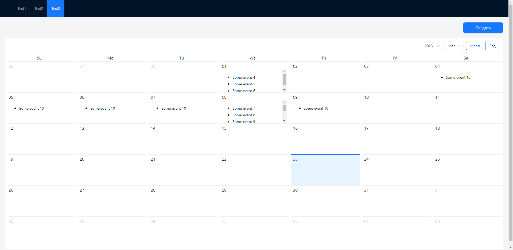

# Host App with layout and connected remotes
## Screenshots

## Deployment

`gpb_container` has been deployed on https://gpb-test-container.netlify.app/ 

## Tech Stack

React, React Router V6, Typescript

## License

[MIT](https://github.com/RostislavBerezhnoy/gpb-with-microfrontends/blob/develop/LICENSE)