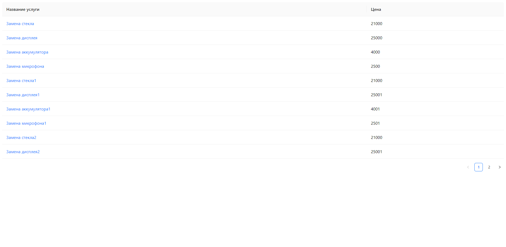

# Test2 app

Here you will find the [task](https://github.com/GPB-COS/test-work-react/tree/master/test%202)

## Backend

In order to run the backend please get the [server app](https://github.com/GPB-COS/test-work-react/tree/master/test%202/backend) and install dependencies via

```bash
yarn
```

Then,

```bash
node server.js
```

## Screenshots



## Tech Stack

React, Typescript, Ant Design, Redux Toolkit (RTK Query)