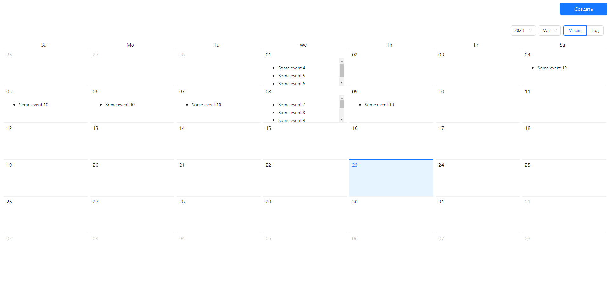

# Test3 app

Here you will find the [task](https://github.com/GPB-COS/test-work-react/tree/master/test%203)

## Backend

In order to run the fake backend please install the [JSON Server](https://github.com/typicode/json-server) via

```bash
yarn global add json-server
```

Then,

```bash
npx json-server --watch db.json --port 5000
```

## Screenshots



## Deployment [without backend]

`gpb_test3` has been deployed on https://gpb-test3.netlify.app/

## Tech Stack

React, Typescript, Ant Design, Redux Toolkit (RTK Query), Formik, Pusher-JS